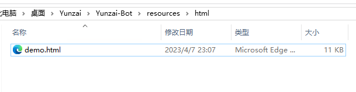

# 扫雷.js

### 介绍
yunzai-bot的扫雷游戏插件

有建议或者bug建议提交一个lssues

请使用 **更新扫雷.js** 安装扫雷插件，步骤请看安装教程 **方法1** 

发送 **扫雷帮助** 查看更新日志和指令

### 安装教程

#### 方法1（推荐）

1. 下载  **更新扫雷.js**  放到 _\plugins\example_ 目录下
2. 发送指令： **更新扫雷** 
3. 这个可以下载 **扫雷.js** 和 **demo.html** ，也能更新插件，非常方便（确信）

#### 方法2

1. 下载 **扫雷.js** 放到  **\plugins\example**  目录下
2. 下载 **demo.html** 放到  **\resources\html** 目录下，没有html文件夹自己创建一个

### 指令

其他内容请看 **扫雷帮助** 

| 指令            | 功能                 | 注意                      | 是否被前缀影响                      |
|---------------|--------------------|-------------------------|-------------------------|
| 扫雷设置指令前缀+前缀内容 | 设置前缀，避免与其他插件发生指令冲突 | 前缀内容会在重启后失效，或者修改了本插件时失效 | 否 |
| 扫雷帮助 | 游戏帮助 |  | 是 |
| 扫雷 | 开始游戏 |  | 是 |
| 扫雷难度：（简单/中等/困难） | 设置难度，开始游戏 |  | 是 |
| 结束扫雷 | 结束游戏 |  | 是 |
| 翻开 | 翻开指定位置 | 坐标可以输入多个，大小写随意，例如：翻开a1c1f1e5 | 是 |
| 标记 | 标记指定位置 | 坐标同上，标记后只能主动翻开 | 是 |
| 取消标记 | 取消标记指定位置 | 坐标同上 | 是 |
| 扫雷设置地雷 | 设置当前难度的地雷数量 |   |  否 |
| 扫雷设置布局 | 自定义布局和雷数量 | 使用空格隔开，一共三个参数，宽、高、雷，例如：扫雷设置布局10 10 10 |  否 |
|更新扫雷|更新和安装扫雷插件|需要安装`更新扫雷.js`|否|
